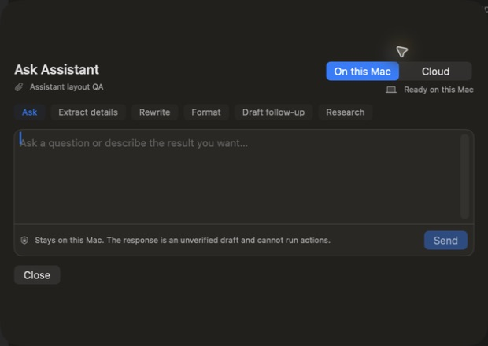
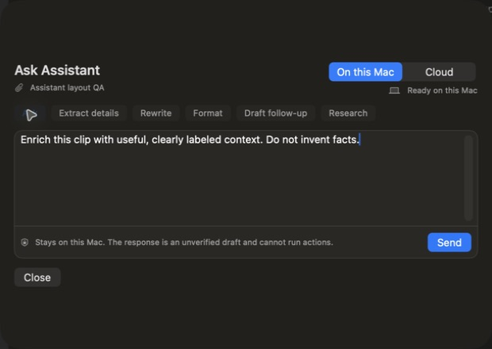

# Ask Assistant interaction audit

Date: 2026-08-11

## Overall health

The original Assistant surface was not healthy: it exceeded the available screen height, placed the primary prompt below a large empty conversation region, clipped key controls, and disappeared when its menu-bar presenter closed. The revised surface is healthy for the tested Library workflow and the six suggestion interactions.

## Journey results

1. **Open Assistant from a Library item — Healthy**
   - Opens as a compact, bounded sheet.
   - The item, processing mode, suggestions, prompt, privacy boundary, Send, and Close controls are visible without scrolling.

2. **Choose an Assistant option — Healthy**
   - Live-tested Ask, Extract details, Rewrite, Format, Draft follow-up, and Research.
   - Each option keeps the sheet open and changes only the reviewed prompt. It does not send automatically.

3. **Open Assistant from the menu bar — Improved**
   - Assistant requests now hand off to the persistent Library window instead of attaching to the transient menu-bar window.
   - The route is covered by a regression test. The macOS status item itself was not addressable by the available accessibility automation, so that exact first click was not mechanically captured.

4. **Dismiss Assistant — Healthy**
   - Close returns to the selected Library item without changing the source item.

## Before

Problems:

- Large empty conversation card consumed the primary visual area before a conversation existed.
- The prompt and footer sat below the main task path and could be clipped.
- Competing scroll regions made the hierarchy unclear.
- A sheet owned by the transient menu-bar window disappeared when that window closed, which looked like a crash.

## After

Improvements:

- The composer is the primary surface; conversation appears only after a request starts.
- The sheet is bounded to 620–760 points wide and 340–620 points high.
- Send and Close remain visible.
- The source item and local/cloud boundary are explicit.
- Suggested actions populate a draft for review; they do not send on selection.

## Accessibility notes

- Suggestions expose selected state and labels.
- The prompt has a descriptive accessibility label.
- Close and Send are visible controls rather than footer-only actions.
- This pass inspected the accessibility tree but did not constitute a full VoiceOver session.

## Verification

- Real macOS QA build: all six suggestion buttons remained open and updated the prompt.
- Focused Assistant/preferences tests: 32 passed.
- Full Swift test suite: 399 passed with zero failures.
- No recent Clipboard Router process crash report was found; the observed behavior was consistent with presentation teardown.
