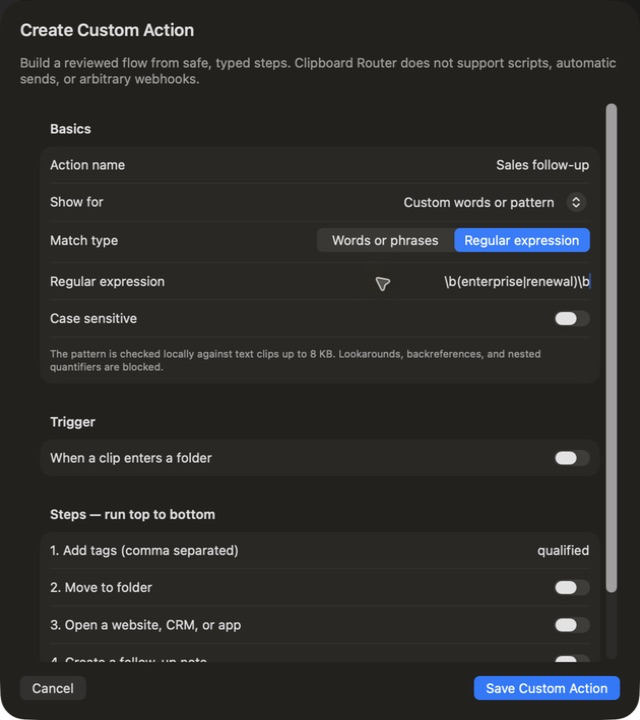

# Custom Clip Matching Audit

## Outcome

Custom clip matching is now a first-class condition in both Custom Actions and One-click Destinations. Users can choose comma-separated words or phrases, or a regular expression, and immediately see whether the condition is valid before saving.

## Flow audit

1. **Open Actions > Create Custom Action** — Healthy. The creation path remains visible beside the actions it controls.
2. **Choose Custom words or pattern** — Healthy. The new option sits with the existing link, email, phone, and date conditions.
3. **Use Words or phrases** — Healthy. Comma-separated values and case sensitivity are explained inline.
4. **Enter an unsafe regular expression** — Healthy fail-closed behavior. The editor displays an inline error and disables Save.
5. **Enter a valid regular expression** — Healthy. The error clears and Save becomes available.

## Evidence

## Safety and test boundary

- Matching runs locally against text clips and is capped at 8 KB of clip text.
- Lookarounds, backreferences, nested quantified groups, and other high-risk patterns are rejected.
- The matcher is revalidated when decoded and rechecked immediately before execution.
- Private Session, Vault, sensitive-content, and incoming-sync execution boundaries remain unchanged.
- Persistence, execution eligibility, and team-sync preservation are covered by automated tests.

This visual pass did not save or execute a real action against the user's clipboard data. It verified discovery, editing, validation, and save-state behavior in an isolated QA build.
