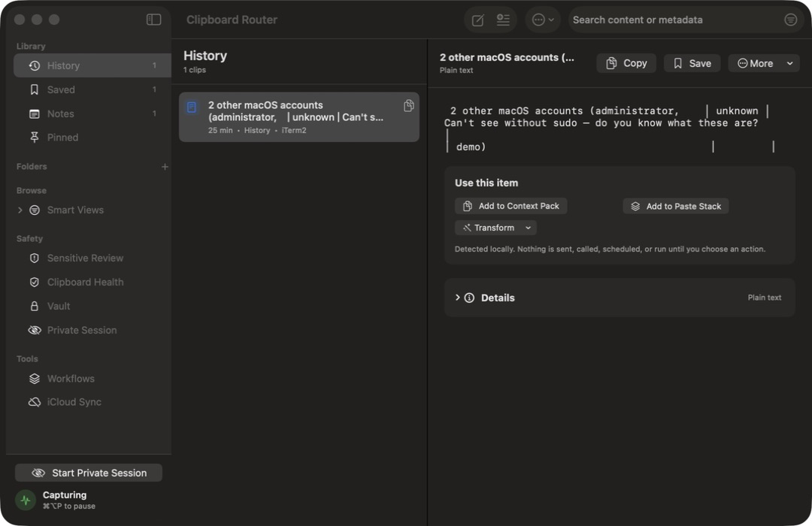
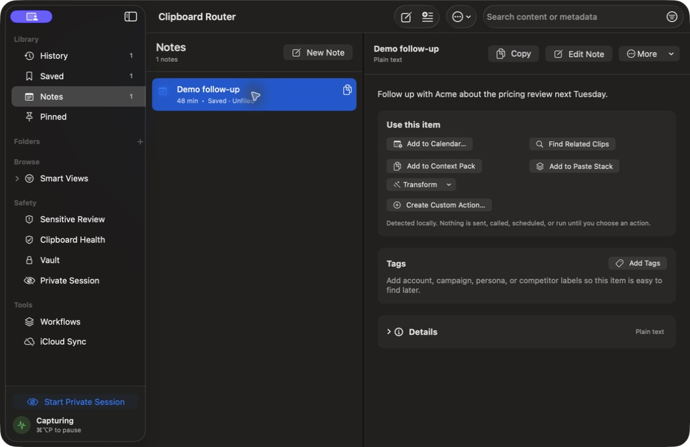
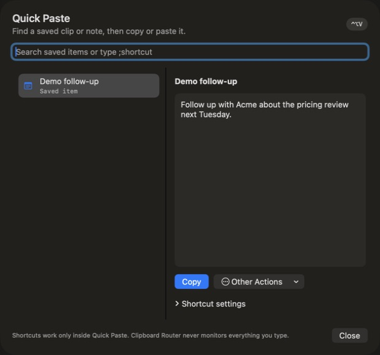

# Clipboard Router second-pass declutter audit

Date: 2026-08-11  
Viewport: 1080 x 700 main window; 620 x 580 Quick Paste  
Method: current packaged app, current SwiftUI sources, Accessibility hierarchy, three specialist reviews, and a Claude Opus review.

## User journey

1. Recover a clip through History, search, the menu bar, or Quick Paste.
2. Keep important material by saving it, turning it into a note, pinning it, or filing it.
3. Use it through copy, paste, a detected action, Assistant, or a reviewed automation.
4. Protect it with sensitive review, Vault, or Private Session.

The current UI exposes product subsystems before this journey. The redesign keeps places persistent and reveals filters, dashboards, and secondary actions only when they are relevant.

## Reference states

### 1. History detail

- Healthy: the three-column structure, search, list selection, and Copy / Save / More header.
- Needs work: the sidebar exposes filters and dashboards as destinations; the generic action card competes with the clip content; the title truncates early.

### 2. Note detail

- Healthy: note editing is a contextual header action.
- Needs work: six equally weighted actions, an empty Tags card, and a Details card create a feature-inventory feel around one line of content.

### 3. Quick Paste

- Healthy: search-first retrieval, list plus preview, Return/Escape support, and invocation-scoped paste safety.
- Needs work: shortcut administration, duplicate explanatory copy, and contradictory minimum column widths turn a recall surface into a management screen.

## Target information architecture

- Persistent places: History, Saved, Folders, Vault.
- Saved modes: All, Notes, Pinned.
- Conditional protection: Review Sensitive Items only when attention is required; Private Session becomes a compact active state and footer command.
- Settings and status: Clipboard Health, Workflows, and iCloud Sync leave the default navigation but remain reachable from focused menus and Settings.
- Detail: content first; Copy, one contextual action, and More in the header; at most two high-confidence suggestions inline; generic actions live once in More.
- Quick Paste: search, selection, preview, one primary action; shortcut editing is progressive disclosure.

## Accessibility and verification limits

The live Accessibility hierarchy was inspected for labels and enabled state. Screenshot inspection cannot prove VoiceOver reading order, every focus ring, Increase Contrast, Reduced Motion, or all Dynamic Type sizes. Those require a separate manual accessibility pass after the rebuilt app is packaged.
