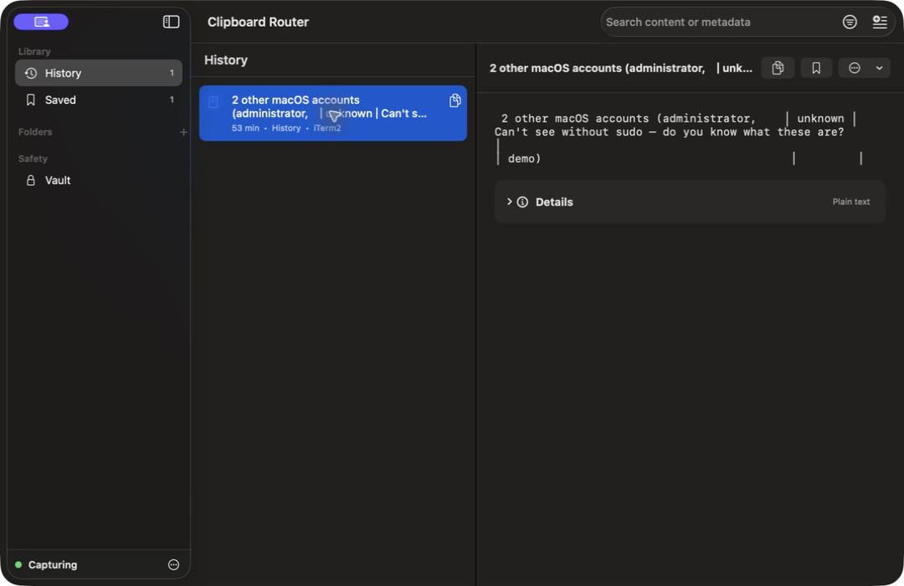
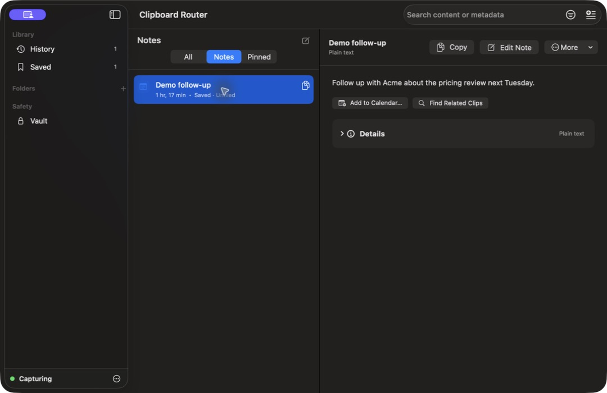
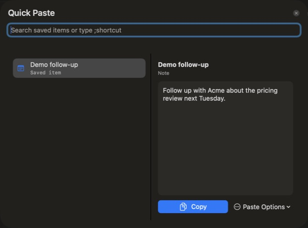

# Clipboard Router declutter verification

Date: 2026-08-11  
Build: private local build artifact; not published
Comparison: same user data and matching application states as the pre-change audit.

## 1. Recover — History and search

Status: **Healthy**

- The sidebar now contains places: History, Saved, folders, and Vault.
- Capture and advanced library controls share one compact footer.
- Search and Quick Paste remain globally available.
- Clip content dominates the detail view; generic workflow controls no longer occupy a permanent card.

## 2. Keep and use — Saved notes

Status: **Healthy**

- Saved, Notes, and Pinned are one explicit segmented journey instead of three permanent sidebar destinations.
- The header contains Copy, Edit, and More.
- Only two content-aware suggestions are visible.
- Empty tags take no space; Details stays collapsed.
- Advanced organization, Assistant, app routing, transforms, automations, sharing, Vault, and deletion remain available under More with their existing eligibility checks.

## 3. Act — Quick Paste

Status: **Healthy**

- Search, selection, preview, and one primary action dominate.
- Shortcut administration moved behind Paste Options.
- The previous target-token validation, Return default action, and Escape dismissal remain intact.
- The sheet now fits its minimum width without contradictory pane minimums.

## Verification completed

- Swift build passed.
- 77 focused application tests passed.
- 381 XCTest tests and 5 Swift Testing tests passed in the full host suite.
- Source shell, plist, privacy manifest, entitlements, and Package.swift verification passed.
- Local release package and code signature verification passed.
- Accessibility hierarchy was inspected for History, Saved modes, Notes, detail actions, Quick Paste row grouping, and Escape dismissal.

## Remaining release boundary

The delivered bundle is ad-hoc signed and local-only. It intentionally has no iCloud entitlement, notarization proof, or two-Mac/two-account CloudKit verification. VoiceOver reading order, Increase Contrast, and every reduced-width state still require a dedicated manual accessibility matrix before public release.
