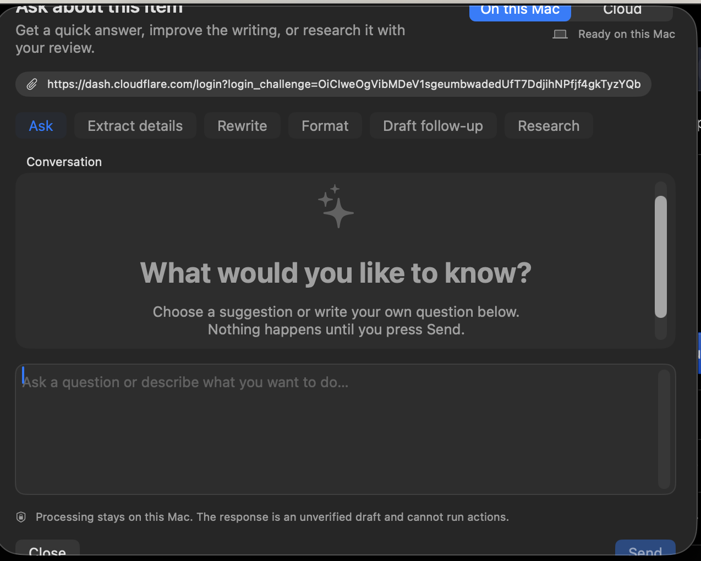
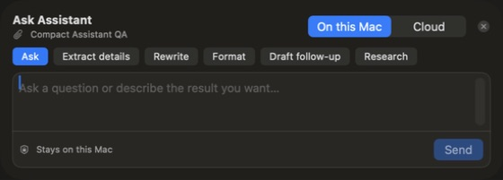
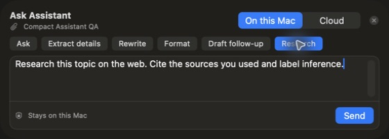

# Compact Assistant redesign audit

Date: 2026-08-12

## Scope

The idle Ask Assistant sheet, its six preset interactions, prompt preservation, keyboard controls, and the handoff from the transient menu-bar window to the persistent Library window.

## User goal

Ask, rewrite, format, enrich, follow up, or research a clip without entering a large empty chat interface. Presets should prepare a reviewed prompt and never send or dismiss the sheet.

## Overall health

The supplied design was unhealthy: an empty conversation card and oversized editor displaced the actual task and pushed controls outside the visible sheet. The redesigned idle surface is healthy in the tested Library workflow: 560 × 201 points, prompt-first, fully visible, and progressively expands only after work begins.

## Journey

1. **Open Assistant — Healthy**
   - The title, source, processing mode, presets, composer, privacy state, Send, and Close are visible without vertical scrolling.
   - The redundant ready-state row is hidden; unavailable states still show an explanation and setup route.

2. **Choose a preset — Healthy**
   - Ask, Extract details, Rewrite, Format, Draft follow-up, and Research were each clicked in the running app.
   - The sheet remained open, the preset announced its selected state, and the matching template replaced the prior untouched template.

3. **Edit the prompt — Healthy**
   - A custom user-written prompt remained unchanged after selecting another preset.
   - Presets do not send. Send remains the only request boundary.

4. **Send and result state — Structurally healthy; provider response not exercised**
   - The idle conversation region does not exist.
   - A response region appears only while working or after a response, with Copy and Save to Notes beside the response.
   - Send is guarded synchronously to prevent rapid duplicate requests.

5. **Menu-bar entry — Improved, with an automation limit**
   - Assistant continues to route to the persistent Library window so closing the menu-bar window cannot destroy the sheet.
   - The macOS status item itself was not addressable by the available accessibility automation. The routing policy and intended presentation surface are covered by tests.

## Before

Highest-impact problems:

- “What would you like to know?” repeated what the composer already communicated.
- Two large idle scroll regions competed for space before any request existed.
- Close and Send could fall below the visible window.
- Choosing a second preset could leave the previous preset's text in the composer.

## After

## Accessibility

Confirmed from the current accessibility tree:

- All six presets expose distinct names and selected/not-selected state.
- The composer is labeled “Question or instruction.”
- Processing mode and Close Assistant are named controls.
- The editor retains focus after preset selection.

Still requiring dedicated assistive-technology testing:

- Full VoiceOver reading order after a streamed or long response.
- Largest accessibility text size and increased-contrast rendering.
- Exact status-item-to-Library interaction because the status item was unavailable to the automation API.

## Verification

- 396 XCTest tests passed.
- 5 Swift Testing tests passed.
- Live macOS QA build: all six preset templates, selected states, sheet persistence, and custom-prompt preservation verified.
